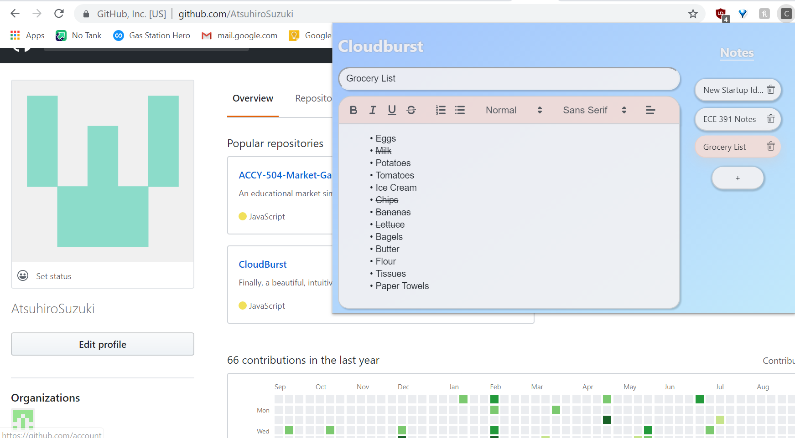
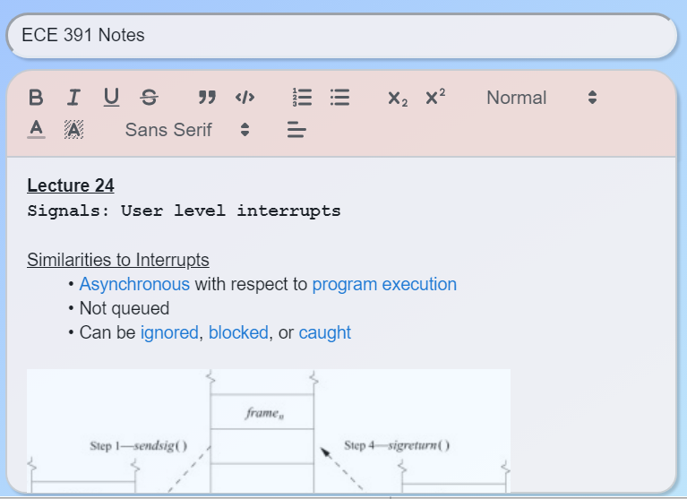
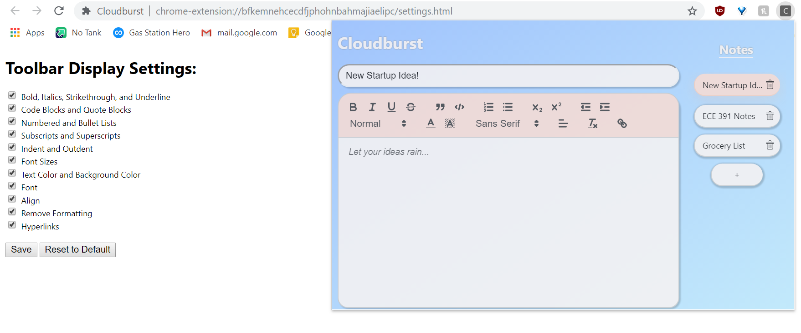
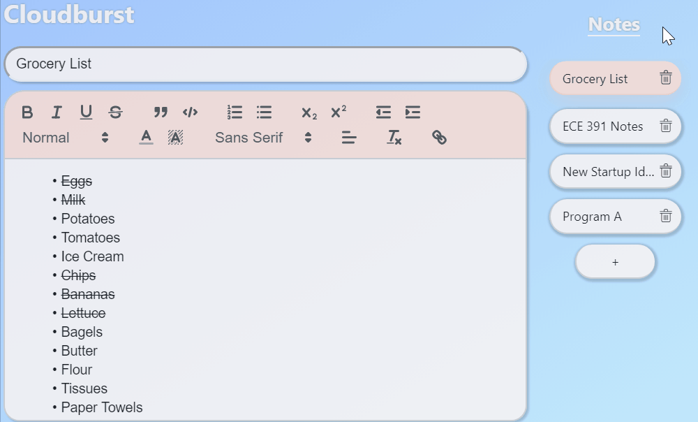
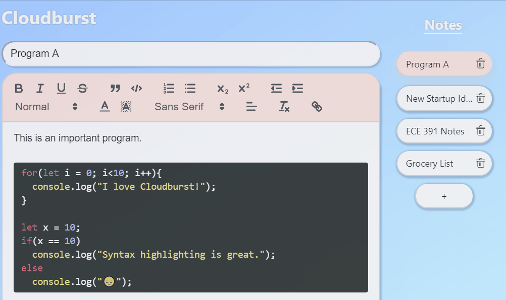

# CloudBurst
This is a note taking web extension designed to be simple, yet powerful - featuring a clean UI and intuitive controls.
Currently still in development and sporting a temporary design - to be released in the coming months on the Chrome Web Store.

# Overview
The notes extension works by simply clicking the extension button in the browser, and a popup will appear with CloudBurst. You view one note at a time, each sporting a customizable title. You can have as many notes as you like, which you can navigate with the notes bar on the side.

Supports full rich text, including images.

Featuring a fully customizable toolbar.

Deleting and adding notes has never been easier!

Features include changing order of notes and code blocks with automatic syntax highlighting.

## In Progress
* Keyboard Shortcuts
* Custom Themes

## BUG TRACKER - For Developer Use
  *Toolbar on font types with long names get wonky

## TODO - For Developer Use

  *Make new themes
  *Timestamps (Change saveNote/saveTitle)
  *Make settings
    **Window Size (Small, Medium, Large)
    **Themes
    **Keyboard Shortcuts (Switching lines [ctrl-shift-up/down], switching notes [ctrl-tab], changing from title (tab, shift-tab to go back, enter), alt-n to open notes app
       to note with tab and vice versa with shift-tab)
  *On new note, move focus to title
  *Google Merchant payments

### Future: 
  *Table Module
  *Blot formatter (resizing images)
  *Sharing Notes w/ live collaboration
  *Animate extension icon
  *Recycle Bin
  *Increase speed
  *Login (Chrome Identity Api)
  *Search functionality
  *Select multiple lines (Ctrl click and Ctrl-Alt-Up/Down)
